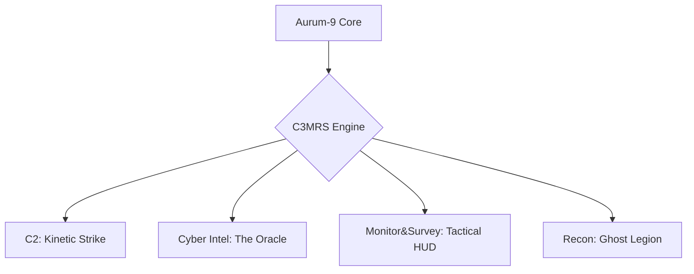

# <p align="center">🛡️ Aurum-9: C3MRS-Framework</p>

<p align="center">
  
</p>

<p align="center">
  
  
  
</p>

**Author:** David Sosnac 

---

## 🚀Model

> Moving beyond reactive SIEMs, Aurum-9 utilizes agentic AI to predict threats and reconfigure networks in real-time.

### 🧩 The C3MRS Blueprint

    
Welcome to **Aurum-9**, a next-generation cybersecurity framework designed to act as an autonomous digital general. Moving beyond reactive SIEMs, Aurum-9 utilizes agentic AI to predict threats, automatically reconfigure networks, and provide high-fidelity 3D visualization of the digital battlefield.

## ⚒️ Framework Architecture (C3MRS)

* **Command & Control (C2) - "The Kinetic Strike Engine":** Autonomous, sub-second defensive actions, micro-segmentation, and dynamic protocol shifting.
* **Cyber-Intelligence - "The Oracle":** Predictive AI trained on adversarial tactics, utilizing a real-time Digital Twin for continuous automated red-teaming.
* **Monitoring & Surveillance - "The Tactical HUD":** Entropy-based behavioral analytics and a 3D WebGL topographic visualization of network infrastructure.
* **Reconnaissance - "The Ghost Legion":** Ephemeral probes and agentic honeypots designed to map internal environments and deceive attackers.

## ⚙️ Iron-Clad Core Features

* **Explainable AI (XAI):** 
Transparent "Logic Receipts" for all autonomous actions.
* **Self-Healing Logic:** 
Immutable hash registries to prevent code drift or tampering.
* **Neural Pruning:** 
Continuous feedback loops to eliminate false positives and alert fatigue.

### 🛠️ Deployment & Setup
Deploy the Aurum-9 framework using our automated setup script. This will configure your virtual environment, install dependencies, and launch the Neural Commander.

### Prerequisites
* **Python 3.11+**
* **Git**
* **Docker** (Optional, for Shadow-Clone containerization)

### Quick Start

**Clone the repository:**
   ```bash
   git clone https://github.com/Dsosnac-TEC-Enterprise/Aurum-9.git
   cd Aurum-9
   ```
**Run the deployment script:**

   ```bash
chmod +x setup.sh
./setup.sh
   ```
**The "Ignition" Sequence:**
Run this ignition sequence if the automated script failed to lauch the Neural Commander.

**Install requirements with pip:**
   ```bash
pip install -r requirements.txt
   ```
**Lauch the Neural Commander:**
   ```bash
python main.py
   ```
**🖥️ Accessing the Tactical HUD:**

Once the backend is running,navigate to the 3D HUD directory:
   ```bash
cd tactical_hud/frontend_3d
python3 secure_server.py
   ```
**Then open your browser to:**
 https://localhost:8443
 
**Note:**
 To view Aurum-9 Operator's Manual and Enterprise Deployment (AWS, AZURE, K8s) see GUIDE.md file.
 
   *Be Enjoying 💯*


  

